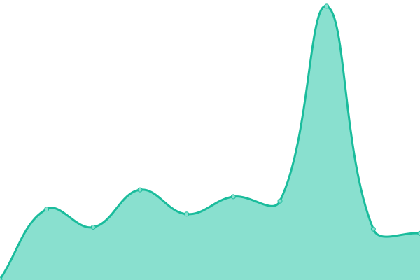
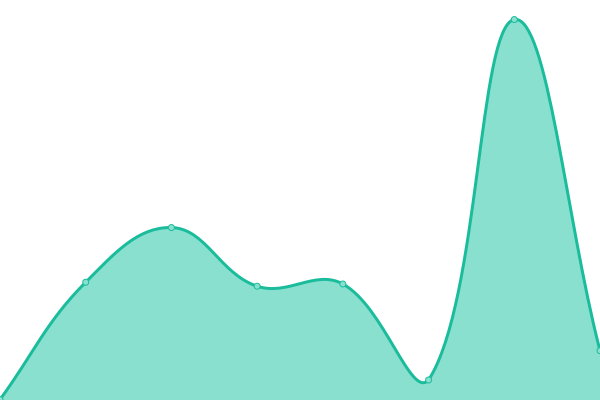
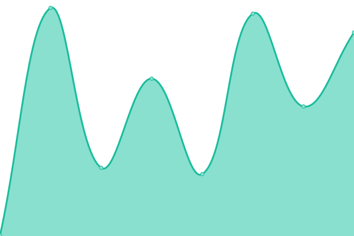
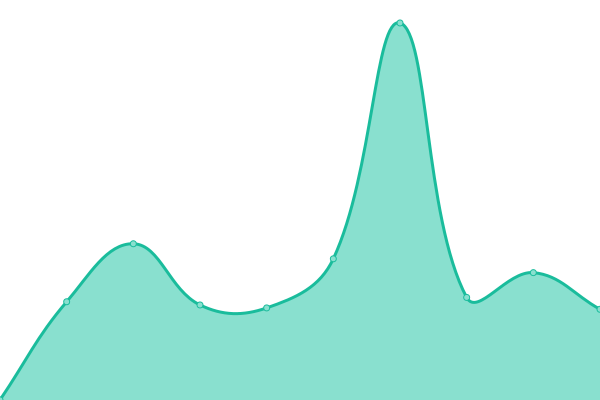
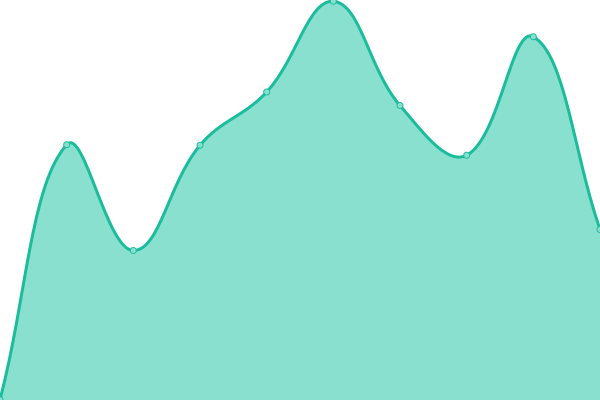
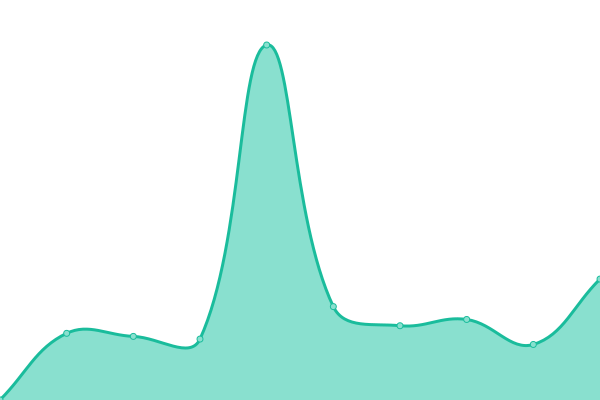

# [📈 Live Status](https://uab-dtic.github.io/monitoring-uab-sbd): <!--live status--> **🟩 All systems operational**

This repository contains the open-source uptime monitor and status page for [UAB-DTIC](https://uab-dtic.github.io/monitoring-uab-sbd), powered by [Upptime](https://github.com/upptime/upptime).

With [Upptime](https://upptime.js.org), you can get your own unlimited and free uptime monitor and status page, powered entirely by a GitHub repository. We use [Issues](https://github.com/upptime/upptime/issues) as incident reports, [Actions](https://github.com/uab-dtic/monitoring-uab-sbd/actions) as uptime monitors, and [Pages](https://demo.upptime.js.org) for the status page.

<!--start: status pages-->
<!-- This summary is generated by Upptime (https://github.com/upptime/upptime) -->
<!-- Do not edit this manually, your changes will be overwritten -->
<!-- prettier-ignore -->
| URL | Status | History | Response Time | Uptime |
| --- | ------ | ------- | ------------- | ------ |
|  [Google](https://www.google.com) | 🟩 Up | [google.yml](https://github.com/uab-dtic/monitoring-uab-sbd/commits/HEAD/history/google.yml) | 

 90ms
     
 | 

<a href="https://uab-dtic.github.io/monitoring-uab-sbd/history/google">100.00%</a>
    

|  [Wikipedia](https://en.wikipedia.org) | 🟩 Up | [wikipedia.yml](https://github.com/uab-dtic/monitoring-uab-sbd/commits/HEAD/history/wikipedia.yml) | 

 163ms
     
 | 

<a href="https://uab-dtic.github.io/monitoring-uab-sbd/history/wikipedia">100.00%</a>
    

|  [Hacker News](https://news.ycombinator.com) | 🟩 Up | [hacker-news.yml](https://github.com/uab-dtic/monitoring-uab-sbd/commits/HEAD/history/hacker-news.yml) | 

 357ms
     
 | 

<a href="https://uab-dtic.github.io/monitoring-uab-sbd/history/hacker-news">100.00%</a>
    

|  [guacamole aules](https://aules.sbd.uab.cat) | 🟩 Up | [guacamole-aules.yml](https://github.com/uab-dtic/monitoring-uab-sbd/commits/HEAD/history/guacamole-aules.yml) | 

 1147ms
     
 | 

<a href="https://uab-dtic.github.io/monitoring-uab-sbd/history/guacamole-aules">92.23%</a>
    

|  [chispa www](https://www.sbd.uab.cat) | 🟩 Up | [chispa-www.yml](https://github.com/uab-dtic/monitoring-uab-sbd/commits/HEAD/history/chispa-www.yml) | 

 1137ms
     
 | 

<a href="https://uab-dtic.github.io/monitoring-uab-sbd/history/chispa-www">92.23%</a>
    

|  [gitlab](https://gitlab.sbd.uab.cat) | 🟩 Up | [gitlab.yml](https://github.com/uab-dtic/monitoring-uab-sbd/commits/HEAD/history/gitlab.yml) | 

 1060ms
     
 | 

<a href="https://uab-dtic.github.io/monitoring-uab-sbd/history/gitlab">99.92%</a>
    

|  [glpi](https://glpi.sbd.uab.cat/index.php?noAUTO=1) | 🟩 Up | [glpi.yml](https://github.com/uab-dtic/monitoring-uab-sbd/commits/HEAD/history/glpi.yml) | 

 1162ms
     
 | 

<a href="https://uab-dtic.github.io/monitoring-uab-sbd/history/glpi">99.92%</a>
    

|  [uspace-alpha-pc](https://uspace-alpha-pc.uab.cat/) | 🟩 Up | [uspace-alpha-pc.yml](https://github.com/uab-dtic/monitoring-uab-sbd/commits/HEAD/history/uspace-alpha-pc.yml) | 

 727ms
     
 | 

<a href="https://uab-dtic.github.io/monitoring-uab-sbd/history/uspace-alpha-pc">99.93%</a>
    

<!--end: status pages-->

[**Visit our status website →**](https://uab-dtic.github.io/monitoring-uab-sbd)

## 📄 License

- Powered by: [Upptime](https://github.com/upptime/upptime)
- Code: [MIT](./LICENSE) © [Anand Chowdhary](https://anandchowdhary.com), supported by [Pabio](https://pabio.com)
- Data in the `./history` directory: [Open Database License](https://opendatacommons.org/licenses/odbl/1-0/)
